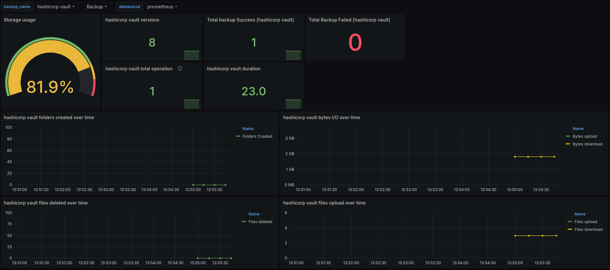

# Duplicati Prometheus Exporter

This is a simple exporter for [Duplicati backup](https://duplicati.com).

## How it works

In the Duplicati web interface or CLI, you can configure advanced options using `"send-http"`. With this configuration, Duplicati will send a POST request to this exporter. The exporter then collects the received metrics and exposes them at the `/metrics` endpoint for Prometheus.

```bash
# CLI configuration example
--send-http-url=http://<duplicati-exporter-instance>:5000/
--send-http-result-output-format=Json
--send-http-any-operation=true
```

## Demo setup

For this demo, Docker must be installed on your machine. This setup includes the Duplicati Prometheus exporter, Prometheus, and Grafana. Additionally, there is a configuration container that sets up the Grafana data source and dashboard. After that, this container sends an example POST request to the exporter.

You can see the full configuration in the [docker-compose file](docker-compose.yml).

- In the repository root, run:

```bash
docker compose up --force-recreate --build --always-recreate-deps
```

- After ~15 seconds, the address `http://localhost:3000` should be available. Access Grafana at:

http://localhost:3000/d/ddmio2e27ctmod/duplicati-backup-dashboard



> This dashboard may change as development continues.

## Prometheus scrape config example

```yaml
global:
  scrape_interval: 60s
  evaluation_interval: 30s

scrape_configs:
  - job_name: duplicati_backup
    honor_labels: true
    static_configs:
      - targets: ['duplicati-prometheus-exporter:5000'] # change to your exporter instance
```

## Running the exporter with Docker

Docker is the recommended way to run this application.

If you prefer, you can build your own container image using the provided [Dockerfile](Dockerfile) to customize it as needed. Alternatively, you can use the prebuilt image available on Docker Hub:

https://hub.docker.com/repository/docker/aleixolucas/duplicati-prometheus-exporter/general

- Run using Docker:

```bash
docker run -p 5000:5000 aleixolucas/duplicati-prometheus-exporter
```

- After the container starts successfully, you can access:

http://127.0.0.1:5000/metrics

(Change the IP if necessary.)

## Running with Python

To run locally, you need Python 3.9 or higher.

You can change the service port by setting the environment variable:

DUPLICATI_EXPORTER_PORT=PORT

(Default is `5000`.)

- In the repository root, create a virtual environment:

```bash
python -m venv .venv
```

- Activate the virtual environment:

```bash
source .venv/bin/activate  # Linux/macOS
```

```bat
.\.venv\Scripts\activate.bat  # Windows
```

- Install required dependencies:

```bash
pip install -r requirements.txt
```

- Run the application:

```bash
python duplicati-prometheus-exporter
```

## Debugging

You can enable debug logging by setting the `LOG_LEVEL` environment variable.

Supported values:

DEBUG, INFO, WARNING, ERROR, CRITICAL

## Pull Requests

Hi everyone! I'm developing this project from scratch and still gaining experience with the Prometheus client library.

Feel free to open issues or submit pull requests to improve the project. Any help is greatly appreciated 🙂
